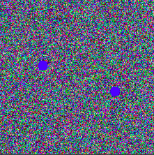
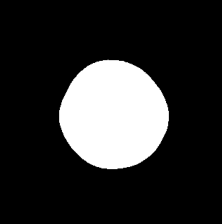

# CNNs-Learns-Without-Boundaries
Do CNNs require edes/boundaries/pixelvariation to learn? Can CNNs learn without explicit pixel variation(information not explicilty represented by pixels in an image)

### Problem Statement : Given two points,can a cnn learn a function that draws a circle with the points as the ends of its diameter.    

  
### Input Image 

  
### GroundTruth Mask 

  
### Model Output Mask 

## References

model.py, loss.py, helper.py are taken from #https://github.com/usuyama/pytorch-unet

